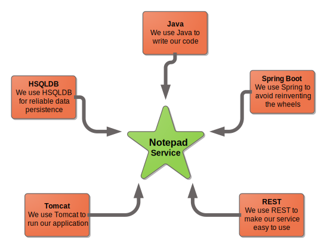

:toc: auto
:toclevels: 3
:sectnums:
:sectnumlevels: 3
:source-highlighter: highlightjs
:app: Notepad application

= {app}

<<<

== Introduction

This document explains what {app} is and what it is not. The sections below describe the intentions behind {app}, boring technical details and fancy diagrams.

=== Goals

Making notes is crucial. It's a well-known fact that 98.37611% of the people who don't make any notes forget about things and miss opportunities. {app} addresses this problem by providing unbelievably ultimate functionality:

* Creating the notes
* Retrieving the notes
* Updating the notes
* Deleting the notes

The {app} team firmly believes that our application makes the world better.

=== Technical overview

{app} is a web application that exposes all its functionality via REST API. It uses Java and Spring as a foundation, and HSQLDB as a reliable production-grade data store.

A typical request is handled like this:

[plantuml, request-handling-pipeline, svg]
----
@startuml

title Request handling pipeline

actor Client

box "Application" #fff
    participant API
    participant Service
end box

note over Client
    Client wants
    to make a request
end note
Client -> API : Please do this thing for me
API -> Service : This guy wants us to do this thing
note over Service
    omg...
    a request...
    again...
end note
API <-- Service : OK, tell them it's done
Client <-- API : It's done
note over Client
    Client is happy
end note

@enduml
----

<<<

== Classes

This sections describes how {app} is organized in terms of packages and classes. All classes are logically organized into packages:

* Controllers - API endpoints implementation.
* Services - business logic implementation.
* Repositories - data access implementation.

[plantuml, class-diagram, svg]
----
include::{snippetsDir}/DocTest/documentClasses/classDiagram.puml[]
----

See how controllers never depend directly on data access layer.

<<<

=== Controllers

This section describes {app} API facade classes.

include::{snippetsDir}/DocTest/documentClasses/controllers.adoc[]

<<<

=== Services

This section describes {app} service layer classes.

include::{snippetsDir}/DocTest/documentClasses/services.adoc[]

<<<

=== Repositories

This section describes {app} data access layer classes.

include::{snippetsDir}/DocTest/documentClasses/repositories.adoc[]

<<<

== Transactions

This section describes {app}'s transactions.

=== Create note transaction
[plantuml, create-note-sd, svg]
----
include::{snippetsDir}/TransactionTest/documentCreateNote/sequenceDiagram.puml[]
----

=== Update note transaction
[plantuml, update-note-sd, svg]
----
include::{snippetsDir}/TransactionTest/documentUpdateNote/sequenceDiagram.puml[]
----

<<<

=== Delete note transaction
[plantuml, delete-note-sd, svg]
----
include::{snippetsDir}/TransactionTest/documentDeleteNote/sequenceDiagram.puml[]
----

=== Get one note transaction
[plantuml, get-one-note-sd, svg]
----
include::{snippetsDir}/TransactionTest/documentGetNote/sequenceDiagram.puml[]
----

<<<

=== Get all notes transaction
[plantuml, get-all-notes-sd, svg]
----
include::{snippetsDir}/TransactionTest/documentGetAllNotes/sequenceDiagram.puml[]
----

The end.

<<<

== Experimental

=== Front end classes

include::{snippetsDir}/FrontEndDocTest/documentClasses/classes.adoc[]

<<<

=== Just a screenshot

image::{snippetsDir}/ScreenshotTest/documentScreenshot/main.png[]

=== Creating a note

Making notes is crucial. Let's get started with an empty {app}, where there are no notes at all. See how empty it is. It is up to us to create the very first note.

image::{snippetsDir}/ScreenshotTest/documentCreateNoteScenario/1.png[]

To do so, we first type note text into a text box:

image::{snippetsDir}/ScreenshotTest/documentCreateNoteScenario/2.png[]

After it, we click the "Create" button. And once we do that, a new note should appear on the list of notes:

image::{snippetsDir}/ScreenshotTest/documentCreateNoteScenario/3.png[]

Done.
